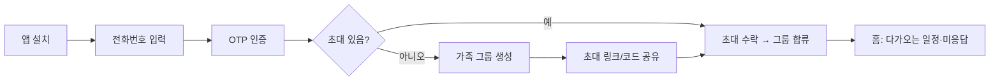
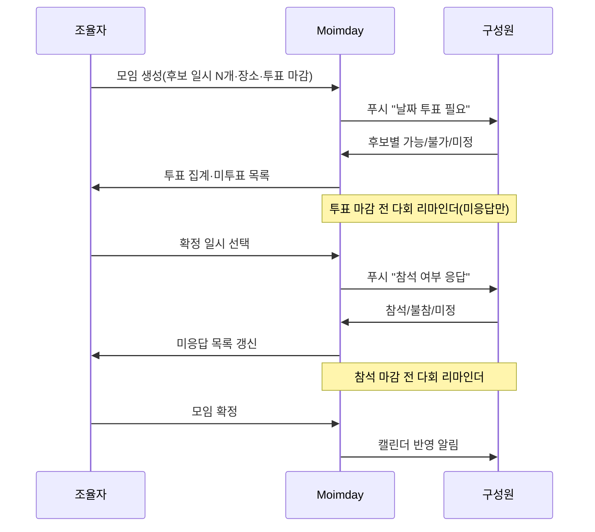

# Moimday PRD

| 항목 | 내용 |
|------|------|
| 문서 버전 | v0.6 |
| 작성일 | 2026-05-20 |
| 최종 수정 | 2026-05-20 (문서 세트 교차 점검) |
| 상태 | **HUMAN 승인 완료** (2026-05-20) — 목업(단계 2) 착수 가능; 제품 구현은 디자인 선택 후 |
| 제품 한 줄 | 가족 일정·모임을 정하고, 누가 아직 답하지 않았는지 보이며, 마감 전에만 독촉하는 모바일 앱 |

---

## 1. 배경과 문제

### 1.1 배경
- 가족 단톡(카카오톡)으로 일상 대화는 되지만, **일정·모임 합의**는 메시지가 묻히고 **응답이 늦는 구성원** 때문에 조율이 어렵다.
- “카톡 확인해 달라”는 **전화·구두 독촉**이 반복되어 피로가 크다.

### 1.2 해결하려는 문제 (Problem Statement)
> 가족이 만날 날짜·장소·참석 여부를 정할 때, **누가 아직 확인·응답하지 않았는지**가 보이지 않고, **응답 행동이 구조화되지 않아** 조율이 지연된다.

### 1.3 제품 가설
- **가족 전용 앱**에 “응답이 필요한 일”만 모으면, 범용 메신저보다 놓치기 어렵다.
- **참석/불참/미정** 같은 단순 행동 + **미응답 가시화** + **마감 전 다회 리마인더**(미응답자만·상한·야간 이월, §8.1)로 전화 독촉을 줄일 수 있다.
- 카카오톡 **완전 대체**가 아니라, **일정·모임·확인** 역할만 분리해도 가치가 있다.

### 1.4 성공 지표 (초안 — 수치는 승인 후 보정)
| 지표 | 설명 | MVP 목표(가정) |
|------|------|----------------|
| 모임 응답률 | 생성 후 마감 전 참석/불참/미정 입력 비율 | 30명 기준 **80% 이상** 이 마감 전 1회 이상 응답 |
| 날짜 투표 참여율 | 투표 모임에서 후보별 1회 이상 표시 | 30명 기준 **80% 이상** 투표 마감 전 참여 |
| 조율 소요 시간 | 모임 생성 → 전원 응답(또는 마감)까지 | 기존 카톡+전화 대비 **체감 단축**(정성 인터뷰) |
| 독촉 전화 빈도 | “카톡/앱 봐줘” 전화 | 월 **감소** (가족 자가 보고) |

---

## 2. 목표와 비목표

### 2.1 목표 (Goals)
1. 가족 그룹 내 **모임·일정**을 한곳에서 생성·공유한다.
2. 구성원이 **참석 / 불참 / 미정**을 쉽게 남기고, **미응답자**를 가족이 볼 수 있다.
3. 응답 마감 전 **푸시 리마인더**로 확인을 유도한다(과도한 스팸 방지).
4. 확정된 일정을 **공유 스케줄(캘린더)** 에 반영한다.
5. **Android·iOS** 모두에서 동일한 핵심 경험을 제공한다.

### 2.2 비목표 (Non-Goals) — MVP
- 카카오톡·문자 **완전 대체**용 범용 메신저
- 대규모 커뮤니티·오픈 소셜
- 영상 통화·결제·쇼핑 등 부가 기능
- 웹 브라우저용 풀 클라이언트 (MVP는 **모바일 앱 우선**; 관리용 웹은 후순위)
- 그룹 간 **교차 권한·연합 캘린더** (v0.3부터 **1인 다중 그룹**은 지원, 그룹별 데이터는 분리)
- **다국어·i18n**, **14세 미만·보호자 동의** 전용 플로우
- 날짜 투표 결과의 **자동 일시 확정**

---

## 3. 사용자와 페르소나

### 3.1 사용자 유형
| 유형 | 설명 | 주요 니즈 |
|------|------|----------|
| **조율자** | 모임·일정을 만드는 사람(부모, 형제 등) | 빠른 합의, 미응답 파악, 독촉 최소화 |
| **응답자** | 참석 여부만 남기면 되는 사람(동생 등) | 알림 부담 적음, **한 번에 끝나는** 응답 UI |
| **구성원** | 일정 조회·가끔 생성 | 공유 캘린더, 가족 일정 한눈에 보기 |

※ **역할 용어:** **그룹 관리자** = 그룹 생성자(멤버·초대·그룹 해체). **모임 생성자** = 해당 모임을 만든 구성원(일시·최종 확정·모임 편집·취소). MVP는 그 외 직책·권한 등급을 두지 않는다.

### 3.2 가정 (Assumptions)
- 가족 구성원 **전원이 스마트폰(Android 또는 iOS)** 을 사용한다.
- **그룹 최대 구성원 수: 30명**(초대·가입 상한). UI·알림·투표 집계는 30명 규모를 기준으로 설계한다.
- 모든 구성원이 앱 **설치·푸시 권한 허용**에 협조한다(미설치 시 가치 급감).
- 한 사용자는 **최대 10개 그룹**에 동시 소속 가능(v0.3). **활성 그룹** 하나를 선택해 홈·모임·캘린더를 본다.
- **만 14세 미만 구성원은 없음** — 보호자 동의·아동 전용 UI는 MVP 범위 밖.
- 앱 언어는 **한국어만** 제공한다.

### 3.3 확정 결정 (2026-05-20)

| ID | 항목 | 확정 내용 |
|----|------|-----------|
| D-1 | 그룹 인원 | **최대 30명** |
| D-2 | 로그인 | **소셜 로그인**(카카오·Google·Apple); SMS OTP **비포함** ([ADR-0005](../decisions/0005-social-oauth-auth.md)) |
| D-3 | 일정 조율 | MVP에 **날짜·시간 후보 투표** 포함 |
| D-4 | 리마인더 | 기본값 **다회·촘촘**(미응답자 대상, §8.1) |
| D-5 | 채팅 범위 | MVP는 **모임 댓글만**; 풀 채팅·가족 채널은 비목표 |
| D-6 | 연령 | **14세 미만 구성원 없음**; 보호자 동의 플로우·아동 계정 정책 **비포함** |
| D-7 | 언어 | **한국어만**; i18n·다국어 UI **비목표(MVP)** |
| D-8 | 일시 확정 | 날짜 투표 후 **조율자 수동 확정**만; 최다 득표 후보 **자동 확정 없음** |

### 3.4 미확정 (Open Questions)

**MVP 제품·정책 범위 내 미확정 항목 없음.**  
(구현 단계 기술 선택만 잔여 — 예: §10 오프라인 캐시 여부, §4.2 크로스플랫폼 스택 A/B.)

---

## 4. 플랫폼 전략 (Android + iOS)

### 4.1 요구사항
- **기능·정책·화면 흐름**은 양 플랫폼에서 동일해야 한다.
- 푸시 알림: **FCM(Android)** + **APNs(iOS)** 모두 지원.
- OS별 차이는 **시스템 권한 안내·딥링크·백그라운드 제한** 정도만 허용한다.

### 4.2 구현 접근 (기술 방향 — PRD 수준, 최종은 구현 단계에서 확정)

| 옵션 | 장점 | 단점 | MVP 적합도 |
|------|------|------|------------|
| **A. React Native (Expo)** | JS/TS 생태계, OTA·빌드 파이프라인 성숙, 푸시 연동 문서 풍부 | 네이티브 모듈 이슈 시 eject | **권장 후보 1** |
| **B. Flutter** | UI 일관성, 단일 코드베이스 | 팀 스택·플러그인 선택 필요 | 권장 후보 2 |
| **C. Kotlin + Swift 네이티브 이중** | OS 최적 UX | 개발·유지 비용 2배 | 소규모 가족 앱에는 **비권장(MVP)** |

**PRD 권장안:** MVP는 **단일 코드베이스 크로스플랫폼(A 또는 B)** + 공통 백엔드 API.  
Gate 2 전에 스택 확정 및 푸시·인증 PoC 1회 수행.

### 4.3 플랫폼별 UX·정책 메모
- **알림 권한:** 최초 가입·첫 모임 수신 시 OS 권한 요청 + “거부 시 리마인더 불가” 안내.
- **배터리 최적화(Android):** 제조사별 제한 안내 FAQ(도움말 화면, MVP는 문서/링크 수준).
- **다크 모드:** 시스템 설정 연동(라이트/다크/시스템) — Gate 2 UI 스펙에 포함.
- **접근성:** 버튼·라벨 명확, 아이콘만으로 의미 전달 금지(product-ui-core).

---

## 5. 핵심 사용자 흐름

### 5.1 가족 그룹 만들기·참여


### 5.2 모임 생성 → 날짜 투표 → 참석 응답 → 확정


※ **단일 일시**로 바로 잡는 모임도 허용(날짜 투표 단계 생략). 생성 시 “후보 투표” / “일시 확정” 중 선택.

### 5.3 일상 확인 (응답자 관점)
**날짜 투표가 있는 모임**
1. 푸시 탭 → 모임 상세 → 후보별 **가능 / 불가 / 미정**.
2. 투표 완료 후, 조율자가 확정 일시를 정하면 다시 푸시.
3. **참석 / 불참 / 미정** 선택 → (선택) 한 줄 메모.

**일시가 이미 확정된 모임**
1. 푸시 탭 → 모임 상세 → **참석 / 불참 / 미정** 한 번.

공통: 홈에서 “투표 완료” / “응답 완료” 상태 표시.

---

## 6. 기능 범위

### 6.1 MVP (Must Have)

#### F1. 계정·가족 그룹
- **전화번호 OTP** 가입·로그인(SMS 인증 코드, 재전송 쿨다운, 시도 횟수 제한).
- **그룹** 생성·초대 합류(**최대 30명**, 1인 **최대 10그룹**, 활성 그룹 전환).
- 프로필: 표시 이름, (선택) 가족 내 호칭/아바타.
- 전화번호는 계정 식별자; 그룹 내에서는 **표시 이름** 우선 노출.

#### F2. 홈 대시보드
- **응답 필요** 모임 목록(본인 미응답 우선): **날짜 투표 미완** / **참석 미응답** 구분 배지.
- **다가오는 확정 일정** 요약.
- **그룹 미응답 현황**(동일 그룹 **전 구성원** 조회, P-G4) — 모임별·단계별(투표/참석) “누가 아직 안 했는지”(최대 30명, 요약+전체 보기, 비난 UI 금지).

#### F3. 모임(Event)

**생성 모드**
| 모드 | 설명 |
|------|------|
| **후보 투표** | 날짜·시간 후보 2~5개 등록 → 구성원 투표 → 조율자가 확정 일시 선택 |
| **일시 확정** | 단일 일시 지정 → 바로 참석/불참 수집(투표 단계 생략) |

| 필드 | 필수 | 비고 |
|------|------|------|
| 제목 | Y | 예: "어머니 생신 식사" |
| 일시(확정) | 투표 후 | 투표 모드에서는 확정 전까지 비움 가능 |
| **일시 후보** | 투표 모드 시 Y | 2~5개, 시간대·종일 옵션 |
| 장소 | N | 텍스트(지도 링크는 v1.1) |
| 메모 | N | |
| **투표 마감** | 투표 모드 시 Y | 기본: 첫 후보일 72시간 전; **생성 시각보다 미래** 필수(P-E7) |
| **참석 응답 마감** | Y | **일시 확정 후**에만 유효; 기본: 확정 일시 24시간 전(P-E8) |
| **대상** | Y | 기본: 전원(최대 30명); **모임 생성 후 가입한 멤버는 자동 포함 안 함**(P-E13) |

##### F3-a. 날짜·시간 후보 투표 (MVP)
- 후보마다 **가능 / 불가 / 미정** (변경 가능, 이력 기록).
- **집계 화면:** 후보별 가능/불가/미정/미응답 명단(30명, 접기·전체 보기).
- **추천 표시:** 가능 인원이 가장 많은 후보 강조(D-8: **자동 확정 없음**).
- **확정 일시:** 조율자가 S14에서 후보 중 하나를 선택해 **수동 확정**(`confirm-datetime`) 후에만 참석 수집 단계로 전환.
- 투표 마감 전: **모임 생성자**만 후보·투표 마감 수정 가능.
- 투표 마감 후: **마감 연장** 시에만 후보 추가·삭제·투표 재개 가능(P-E11); 연장 시 미투표자 재알림 1회.
- 투표 마감 후 구성원의 **투표 변경**은 P-E11에 따름.

##### F3-b. 참석 응답
- 확정 일시가 정해진 뒤 **참석 / 불참 / 미정** 수집.

**알림 (D-4 반영 — 미응답자만, 야간 방해 금지 준수):**
- 모임·투표 생성 시: 대상자에게 푸시 **1회**.
- **기본 리마인더 일정**(각 마감 시각 기준, 미완료 항목에만):
  - **72h, 48h, 24h, 12h, 6h, 3h, 1h** 전
  - 마감일 당일 **10:00** 1회(미응답 시, 설정으로 끄기 가능)
- 동일 모임·**단계별**(투표 / 참석) 자동 리마인더 각 **최대 8회**(P-N4); 모임 전체 합산 상한 없음.
- **모임 생성자** **수동 독촉**은 단계별 **일 1회** 추가(P-N2).
- 개인 설정: **자동** 리마인더만 끄기(P-N6); 수동 독촉·인앱·홈 미응답 표시는 유지.

**상태 (제품):** `초안` → `날짜 투표 중` → `참석 수집 중` → `모임 확정` | `취소`  
**상태 (API enum):** [data-model.md](../api/data-model.md) — `poll_open` → `attendance_open` → `finalized` | `cancelled`  
- `confirm-datetime` 후 API는 **`attendance_open`**(참석 수집). UI 칩 **「일시 확정됨」** 은 `attendance_open` 초기에 표시 가능(별도 `datetime_locked` 유지 **안 함**).  
- `모임 확정`: **모임 생성자**가 최종 확정(P-E10); **캘린더 반영은 이 상태에서만**(P-E6).

#### F4. 공유 스케줄(캘린더)
- 상태 **`모임 확정`**인 모임만 캘린더에 표시(P-E6). `일시 확정됨`·`참석 수집 중`은 캘린더 미표시.
- 월/주 리스트 뷰(MVP 최소: **리스트 + 월 달력 그리드** 중 하나는 필수, 둘 다 권장).
- 모임 상세에서 캘린더 항목으로 이동.

#### F5. 알림 센터(인앱)
- 모임 생성·리마인더·확정·취소 이력.
- 읽음/안 읽음(MVP 단순 구현 가능).

#### F6. 모임 스레드(경량 커뮤니케이션) — D-5 확정
- 모임 상세 하단 **댓글**만(MVP). **풀 채팅·가족 공지 채널·1:1 DM**은 비목표.
- 용도: “저녁 6시로 변경됐어요” 수준의 짧은 코멘트.

### 6.2 v1.1 이후 (Should / Could)
| 기능 | 우선순위 | 비고 |
|------|----------|------|
| 반복 일정(매주·매월) | Could | |
| **풀 채팅** / 가족 공지 채널 | Could | 카톡 대체 확대 시 |
| SMS/이메일 **에스컬레이션** | Could | 푸시 무시 시, 비용·동의 필요 |
| 여러 가족 그룹 | Could | |
| iOS/Android **위젯** | Could | 미응답 카운트 |
| 캘린더 외부 연동(Google/Apple) | Could | 읽기 전용 export |

### 6.3 Won’t (명시적 제외)
- 공개 마켓·낯선 사람 초대
- 대용량 파일·음성 메시지
- 광고·데이터 판매

---

## 7. 화면 목록 (화면 스펙 초안)

목업 단계에서 Figma/Stitch·자체 목업으로 구체화한다. MVP 화면 ID:

| ID | 화면명 | 주요 상태 |
|----|--------|-----------|
| S01 | 스플래시·온보딩 | 기본 / 권한 거부 안내 |
| S02 | 전화번호·OTP 로그인·가입 | 로딩 / 형식 오류 / OTP 만료·불일치 / 잠금 / 재전송 대기 |
| S03 | 그룹 생성·초대 | 빈 그룹 / 초대 대기 |
| S04 | 홈 | 로딩 / 빈(일정 없음) / 미응답 강조 |
| S05 | 모임 목록 | 필터: 전체·내 미응답 |
| S06 | 모임 생성·편집 | 투표/단일 일시 분기 / 후보 2~5개 유효성 |
| S07 | 모임 상세 | 투표 중·참석 수집·확정·취소 / **만료·취소 읽기 전용** / 권한 없음 |
| S08 | 응답 바텀시트 | 날짜: 가능·불가·미정 / 참석: 참석·불참·미정 |
| S13 | 날짜 투표 집계 | 빈 투표 / 30명 요약+전체 보기 |
| S14 | 확정 일시 선택 | 투표 결과 기반 조율자 확정 |
| S09 | 스케줄(캘린더) | 빈 / 로딩 |
| S10 | 알림 목록 | 빈 |
| S11 | 설정 | 프로필·**리마인더 on/off**·그룹 나가기 |
| S12 | 도움말(푸시·배터리) | — |

**공통 상태 UI (Gate 2):** 기본 · 로딩 · 빈 · 오류(네트워크·서버·재시도) · 권한 · **만료/취소(읽기 전용)** · **동시 수정 충돌(새로고침)**.

---

## 8. 정책·예외

### 8.0 정책 용어·우선순위
- **조율자** = 문맥상 **모임 생성자**(해당 모임). **그룹 관리자**와 혼용하지 않는다.
- 동일 주제에서 **확정 결정(D-*)** · **본 절 규칙(P-*)** 이 일반 서술(§1·§6 본문)과 충돌하면 **D-* 및 P-*가 우선**한다.

### 8.1 알림·리마인더 정책 (D-4 확정)
| 규칙 | 내용 |
|------|------|
| P-N1 | “응답 필요” 푸시는 **해당 모임 대상자**에게만 |
| P-N2 | 자동 리마인더는 **미응답·미투표자만**; 조율자 **수동 독촉**은 단계별 **일 1회** 추가 |
| P-N3 | **야간 방해 금지**(기본 22:00–08:00) — 해당 시간 예정 푸시는 **다음 허용 시각(08:00)** 으로 이월 |
| P-N4 | 기본 자동 리마인더: **해당 단계 마감**(투표 마감 또는 참석 마감) 기준 **72h·48h·24h·12h·6h·3h·1h** + 마감일 **10:00** 1회; **투표 단계·참석 단계 각각** 최대 **8회** 후 해당 단계 자동 리마인더 중단 |
| P-N5 | 푸시 권한 거부 시: 인앱·홈 “응답 필요” 유지; 설정에 권한·배터리 안내 |
| P-N6 | 구성원이 **본인 자동 리마인더** 끄기 가능; 가족 미응답 목록·수동 독촉 수신·인앱 알림은 유지 |
| P-N7 | 30명 규모: **그룹 푸시 폭주** 방지 — 동일 이벤트는 인원별 개별 예약, 서버 rate limit |
| P-N8 | **투표 단계** 리마인더는 **투표 마감**만 기준; **참석 단계**는 **`일시 확정됨` 이후**·**참석 마감** 기준으로만 발송 |
| P-N9 | P-N3으로 **08:00에 이월**된 푸시는 사용자·모임·단계당 **1건으로 합산** 발송(동시 다건 방지) |
| P-N10 | 대상자가 **투표 완료(P-E16)** 또는 **참석 응답** 완료 시 해당 단계 **예약 리마인더 즉시 취소** |
| P-N11 | **수동 독촉**은 해당 단계 **미완료 대상자**에게만 발송 |

### 8.2 모임·응답 정책
| 규칙 | 내용 |
|------|------|
| P-E1 | **참석 마감** 후 **불참·미정**만 변경 허용(이력); **참석** 변경은 마감 **전**만. 변경 시 모임 생성자 알림 |
| P-E2 | 모임 **취소**는 **모임 생성자**만; **삭제**는 취소 후 30일 경과 또는 생성자·그룹 관리자(MVP). 취소·삭제 시 전원 알림 + 캘린더 제거 |
| P-E3 | 그룹 **탈퇴**·**계정 삭제** 시 개인정보처리방침에 따름(초안: 탈퇴·삭제 요청 후 30일 내 삭제, 법무 보관 예외 제외 — 법무 검토 권장) |
| P-E4 | 날짜 투표 종료(또는 마감 전 조기 확정) 후 **해당 모임 생성자만** 확정 일시 지정(D-8); 자동 확정 **없음** |
| P-E5 | 가입 시 **만 14세 이상** 이용 확인(체크박스·약관); D-6 전제 |
| P-E6 | **캘린더**·외부 일정 요약(F4)은 상태 **`모임 확정`**만 노출 |
| P-E7 | **투표 마감**·**참석 마감**은 생성·수정 시 **현재 시각 이후**만 허용; **첫 후보 일시**는 투표 마감보다 **이후** |
| P-E8 | **후보 투표** 모드: **참석 응답 마감**은 `confirm-datetime` **이후**에만 설정·발효; 기본값 = 확정 일시 **24시간 전**(단, 생성 시점보다 미래) |
| P-E9 | **일시 확정** 모드: 생성 시 일시·참석 마감 동시 설정; 투표 단계·투표 마감 **없음** |
| P-E10 | **최종 모임 확정**은 **모임 생성자** 수동; **참석 마감 전** 가능. 확정 시 해당 모임 **참석 단계 자동 리마인더 중단** |
| P-E11 | **투표 마감** 전: 투표 **변경 자유**. **투표 마감** 후: **변경 불가**(조회만). **마감 연장** 시 기존 투표 유지·다시 변경 가능; **후보 추가·삭제** 시 미투표자 재알림 1회 |
| P-E12 | **모임 편집**(제목·장소·메모): **모임 생성자**만, 상태 `취소`·`모임 확정` **제외**. **일시 확정** 후 일시 변경은 **취소 후 재생성**(MVP) |
| P-E13 | **대상자 스냅샷**: 모임 생성 시점의 그룹 멤버 ID 목록 고정. 이후 가입자에게 **소급 알림·투표 의무 없음** |
| P-E14 | **취소**된 모임: 투표·참석·댓글·독촉 **불가**(읽기 전용). 예약 리마인더 **전량 취소** |
| P-E15 | **모임 생성자**가 그룹 **탈퇴** 시: 진행 중 모임은 **취소** 또는 그룹 관리자에게 **생성자 이관** 선택(이관 전까지 편집·확정 잠금) |
| P-E16 | **투표 완료** 정의: 대상자가 **모든 후보**에 대해 1회 이상 표시(가능/불가/미정). 미완료 시 “투표 미완” |
| P-E17 | **0명 가능** 후보도 조율자가 **수동 확정 가능**(경고 UI); 자동 확정은 없음(D-8) |

### 8.3 그룹·계정·초대 정책
| 규칙 | 내용 |
|------|------|
| P-G1 | **1 OAuth 계정(provider+subject) = 1 User**; **1사용자 = 최대 10그룹** 동시 소속. 상한 초과 시 생성·가입 거부(`USER_GROUP_LIMIT`). **활성 그룹**은 `lastActiveGroupId`로 관리 |
| P-G2 | **그룹 관리자**(그룹 생성자): 멤버 **보내기**, 초대 **재발급**, 그룹 **해체**. **모임 생성**은 **전 구성원** 가능 |
| P-G3 | **정원 30명**: 활성 멤버 + **대기 중 초대** 합산 **30명** 상한; 초과 초대·가입 거부 |
| P-G4 | **미응답·미투표 명단**은 **동일 그룹 구성원 전원** 열람(전화번호 **비노출**, 표시 이름만) |
| P-G5 | 초대 링크: **7일** 만료, **무제한 사용** 가능(정원 내). 만료·재발급 시 **기존 링크 무효** |
| P-G6 | MVP는 **전화번호 미수집**(소셜 로그인); 구성원에게는 **표시 이름**만 노출 |
| P-G7 | **그룹 관리자 탈퇴** 시: 탈퇴 전 **다른 구성원에게 관리자 이관** 필수, 또는 **그룹 해체**만 허용 |
| P-G8 | **정원 동시 가입**(초대 수락 레이스): 선착순 **30명**까지 성공, 초과분은 `GROUP_FULL` 거부 |
| P-G9 | **만료·무효** 초대 링크: 수락 불가 + **재요청** 안내(관리자 재발급) |

### 8.4 인증(소셜) 정책
| 규칙 | 내용 |
|------|------|
| P-A1 | 제공자: **kakao**(accessToken), **google**·**apple**(idToken); 서버에서 토큰 검증 |
| P-A2 | 가입 시 **만 14세 이상·약관 동의** 체크(P-E5); 제공사 프로필로 표시 이름 초기화 |
| P-A3 | **계정 자동 병합 없음** — 제공자별 별도 User (2차: 계정 연동 검토) |
| P-A4 | iOS: Google·카카오 제공 시 **Sign in with Apple** 동시 제공 |
| P-A5 | **세션 만료**(401): 보호 API 차단 → 로그인 화면 |
| P-A6 | 재로그인 시 `sessionVersion` 증가 → 기존 refresh 무효(단일 활성 세션) |

### 8.5 프라이버시·보안 (초안)
- 가족 그룹 데이터는 **구성원만** 조회.
- 초대 링크는 **만료·재발급** 가능(MVP: 7일 만료 가정).
- 전송 구간 TLS, 저장 시 최소 PII.
- **대한민국·한국어 전용**(D-7); 이용약관·개인정보처리방침 **한국어**만 제공.
- 14세 미만 아동 대상 별도 동의·계정 유형은 **다루지 않음**(D-6).
- 모임 **댓글**: 작성자·**모임 생성자**·**그룹 관리자**만 **삭제** 가능(MVP).

### 8.6 엣지케이스·실패 시나리오

#### 8.6.1 인증·계정
| 시나리오 | 기대 동작 | 코드(예) |
|----------|-----------|----------|
| 잘못된 번호 형식 | 발송 버튼 비활성 + 필드 오류 | `INVALID_PHONE` |
| OTP 만료(3분) | “코드 만료” + 재전송 | `OTP_EXPIRED` |
| OTP 불일치 | 남은 시도 표시(5회) | `OTP_INVALID` |
| OTP 일일 상한·잠금 | 24h 후 재시도 안내 | `OTP_RATE_LIMITED` |
| 토큰 만료·무효 | 로그인 유도(P-A5) | `UNAUTHORIZED` |
| 계정 삭제 요청 | 30일 처리(P-E3); 진행 중 모임은 P-E15 |

#### 8.6.2 그룹·초대
| 시나리오 | 기대 동작 | 코드(예) |
|----------|-----------|----------|
| 그룹 수 상한(10개) 초과 시 생성/가입 | 거부(P-G1) | `USER_GROUP_LIMIT` |
| 이미 해당 그룹 멤버인데 초대 수락 | active 전환만 | `ALREADY_MEMBER`(선택) |
| 정원 초과 초대·수락 | 거부(P-G3·P-G8) | `GROUP_FULL` |
| 만료/무효 초대 링크 | 수락 불가(P-G9) | `INVITE_EXPIRED` |
| 관리자 탈퇴 시 이관 없음 | 탈퇴 차단(P-G7) | `ADMIN_TRANSFER_REQUIRED` |
| 앱 미설치 초대 대상 | “대기 중”; 가입 시 일반 멤버만(소급 모임 없음) | — |
| 그룹 해체 | 진행 중 모임 **일괄 취소** + 알림 | — |

#### 8.6.3 모임·투표·참석
| 시나리오 | 기대 동작 | 코드(예) |
|----------|-----------|----------|
| 후보 1개·0개로 투표 모드 생성 | 저장 차단(2~5개) | `VALIDATION_ERROR` |
| 후보 일시 **전부 과거** | 저장 차단 | `DATE_IN_PAST` |
| 투표 마감 ≤ 생성 시각 또는 ≥ 첫 후보 | 저장 차단(P-E7) | `INVALID_DEADLINE` |
| 확정 일시가 **과거** | `confirm-datetime` 거부 | `DATE_IN_PAST` |
| 투표 마감 후 투표·후보 변경 | UI 비활성; API 거부(P-E11) | `POLL_CLOSED` |
| 일시 미확정 상태에서 참석 API | 거부(P-E8) | `DATETIME_NOT_CONFIRMED` |
| 참석 마감 후 **참석**으로 변경 | 거부; 불참·미정만(P-E1) | `ATTENDANCE_CLOSED` |
| 취소된 모임에 액션 | 읽기 전용(P-E14) | `EVENT_CANCELLED` |
| 비대상자·비멤버 접근 | 403 | `FORBIDDEN` |
| 비생성자의 확정·취소·독촉 | 403 | `FORBIDDEN` |
| **0명 가능** 후보 확정 | 허용 + 확인 다이얼로그(P-E17) | — |
| 투표 **일부 후보만** 표시 | “투표 미완”; 저장 시 **전 후보 입력** 요구(P-E16) | `INCOMPLETE_POLL` |
| 마감 직전 화면 열림 → 제출 시 마감됨 | 서버 거부 + “마감됨” + **새로고침** | `POLL_CLOSED` / `ATTENDANCE_CLOSED` |
| 중복 제출(더블탭) | **멱등** 처리 — 동일 결과 재전송 시 성공 | — |
| 생성자 탈퇴·이관 대기 | 확정·편집 잠금(P-E15) | `ORGANIZER_UNAVAILABLE` |

#### 8.6.4 알림·댓글·클라이언트
| 시나리오 | 기대 동작 |
|----------|-----------|
| 응답 완료 **후** 예약된 리마인더 | 서버가 **해당 단계 리마인더 취소** |
| 모임 **취소** 후 푸시·리마인더 | 전량 취소(P-E14) |
| 푸시 탭 시 삭제·취소된 모임 | “취소된 모임” 읽기 전용 |
| 댓글 빈 문자열·길이 초과(500자) | 클라이언트 차단 + `VALIDATION_ERROR` |
| 취소된 모임에 댓글 | 거부 |
| **5xx·타임아웃** | 재시도 버튼(최대 3회) + 오프라인 안내 |
| **409** 동시 수정 | “다른 기기에서 변경됨” + **새로고침**(§8.7) |

### 8.7 에러 처리·클라이언트 기준 (MVP)

| 규칙 | 내용 |
|------|------|
| X-1 | API 오류는 `{ error: { code, message } }` 통일(§9); `message`는 **한국어** 사용자 문구 |
| X-2 | **네트워크·5xx**: 비파괴 GET은 **자동 재시도 1회**; POST(투표·참석)는 **멱등 키** + 실패 시 **재시도 버튼** |
| X-3 | **4xx**: 재시도 없음; 필드 오류는 **인라인**, 그 외 **토스트·다이얼로그** |
| X-4 | **401**: 로그인 화면; **403**: “권한 없음”; **404**: “삭제되었거나 없음” |
| X-5 | 모임 수정·확정 API는 **`updatedAt` 또는 `version`** — 불일치 시 **409** + 새로고침 |
| X-6 | 로딩 **3초** 초과 시 스켈레톤 유지 + “연결이 느립니다” |
| X-7 | 치명적 오류 화면에 **문의 없음**(MVP); 로그는 클라이언트에 **민감정보 미포함** |

### 8.8 오프라인·동시성 (MVP 범위)
| 항목 | MVP |
|------|-----|
| 오프라인 읽기 | 홈·모임 **마지막 성공 응답 캐시** 표시 + “오프라인” 배너 |
| 오프라인 쓰기 | 투표·참석·댓글 **불가** — 버튼 비활성 + 안내(큐잉 **비목표**) |
| 동시 수정 | X-5(409); 마지막 쓰기 **단독 폴백 없음** |

---

## 9. API·데이터 계약

**Gate 2 SSOT:** [docs/api/api-contract-mvp.md](../api/api-contract-mvp.md), [data-model.md](../api/data-model.md), [error-catalog.md](../api/error-catalog.md).  
교차 참조: [document-crosswalk.md](../document-crosswalk.md).

엔티티 개요:

```
User, FamilyGroup, Membership, Event, DateOption, DateVote, EventResponse,
Comment, Notification, CalendarEntry(뷰)
```

**대표 REST (예시, 경로·필드는 Gate 2 확정):**

| Method | Path | 설명 |
|--------|------|------|
| POST | `/auth/otp/request` | 전화번호 OTP 발송 |
| POST | `/auth/otp/verify` | OTP 검증·토큰 발급 |
| POST | `/auth/token/refresh` | 토큰 갱신 |
| POST | `/groups` | 그룹 생성 |
| POST | `/groups/{id}/invites` | 초대 발급 |
| POST | `/invites/{token}/accept` | 초대 수락(P-G1·P-G3 검증) |
| POST | `/events/{id}/finalize` | 모임 최종 확정(P-E10) |
| POST | `/events/{id}/nudge` | 수동 독촉(P-N2, 모임 생성자) |
| GET | `/groups/{id}/home` | 홈 요약(미응답·다가오는 일정) |
| CRUD | `/groups/{id}/events` | 모임 |
| CRUD | `/events/{id}/date-options` | 날짜·시간 후보 |
| PUT | `/events/{id}/date-votes` | 후보별 가능/불가/미정 (멱등) |
| GET | `/events/{id}/date-poll-summary` | 투표 집계(30명, yes/no/maybe/pending 명단) |
| POST | `/events/{id}/confirm-datetime` | 확정 일시 지정 |
| PUT | `/events/{id}/responses` | 참석/불참/미정 (멱등) |
| POST | `/events/{id}/extend-poll-deadline` | 투표 마감 연장·후보 변경(P-E11) |
| GET | `/users/me` | 내 프로필·그룹 소속 |
| GET | `/groups/{id}/calendar` | 확정 일정 목록 |
| GET/POST | `/events/{id}/comments` | 모임 댓글 |
| GET | `/notifications` | 알림 목록 |

**오류 형식 (Gate 2 확정):**
```json
{ "error": { "code": "EVENT_NOT_FOUND", "message": "모임을 찾을 수 없어요." } }
```

**공통 HTTP 매핑 (X-1~X-4):**

| HTTP | 대표 code | 용도 |
|------|-----------|------|
| 400 | `VALIDATION_ERROR`, `INVALID_PHONE`, `DATE_IN_PAST`, `INVALID_DEADLINE`, `INCOMPLETE_POLL` | 입력·상태 검증 |
| 401 | `UNAUTHORIZED` | 토큰 없음·만료 |
| 403 | `FORBIDDEN` | 비멤버·비권한 |
| 404 | `NOT_FOUND`, `EVENT_NOT_FOUND` | 리소스 없음 |
| 409 | `CONFLICT`, `VERSION_MISMATCH` | 동시 수정 |
| 429 | `OTP_RATE_LIMITED`, `RATE_LIMITED` | OTP·API 상한 |
| 503 | `SERVICE_UNAVAILABLE` | 점검·과부하 |

**도메인 code (§8.6 참조):** `USER_GROUP_LIMIT`, `ALREADY_MEMBER`, `GROUP_FULL`, `INVITE_EXPIRED`, `OTP_EXPIRED`, `OTP_INVALID`, `POLL_CLOSED`, `ATTENDANCE_CLOSED`, `EVENT_CANCELLED`, `DATETIME_NOT_CONFIRMED`, `ADMIN_TRANSFER_REQUIRED`, `ORGANIZER_UNAVAILABLE`

**인증:** Bearer JWT(가정). 그룹 단위 **멤버십 검증** 필수.  
**멱등:** `PUT .../date-votes`, `PUT .../responses` — 헤더 `Idempotency-Key`(UUID) 권장.  
**시간:** 모든 datetime **ISO 8601 +09:00 (KST)**.

---

## 10. 비기능 요구사항

| 항목 | MVP 목표 |
|------|----------|
| 가용성 | 서비스 중단 시 읽기 캐시/재시도 UX |
| 성능 | 홈·목록 **2초 이내** 체감 로딩; 투표 집계(30명) **1초 이내** |
| OTP | SMS 발송 **30초 이내** 도달 목표(통신사·업체 의존) |
| 그룹 규모 | 멤버·초대 상한 **30명**; 1인 **10그룹** |
| 오프라인 | §8.8: 읽기 캐시 + 배너; 쓰기 불가 |
| 스토어 | Google Play + Apple App Store 배포 전제 |
| 로케일 | UI·푸시·오류 메시지 **한국어만**(D-7); 문자열 외부화는 권장하되 번역 파일은 MVP 비포함 |
| 분석 | MVP: 최소 이벤트(가입, 모임 생성, 응답 완료) — 개인정보 최소화 |

---

## 11. 릴리즈 단계

| 단계 | 범위 | 산출 |
|------|------|------|
| **M0** | PRD 승인 | 본 문서 v1.0 |
| **M1** | 디자인(이중 목업) + Gate 2 API·UI 상태 확정 | 목업, API 스펙 |
| **M2** | MVP 기능 F1–F6 + 푸시 | TestFlight·내부 테스트 APK |
| **M3** | 가족 파일럿 10명(4~8주) | 피드백·v1.1 백로그 |
| **M4** | 스토어 공개(선택) | 심사·운영 모니터링 |

---

## 12. 리스크

| 리스크 | 완화 |
|--------|------|
| 핵심 구성원 앱 미설치 | 온보딩 3분 이내, 초대 카카오 공유, 조율자용 “미가입자” 표시 |
| 알림 무시(카톡과 동일) | 1탭 응답 + 미응답 가시화; **다회 리마인더**는 P-N6·야간 이월로 조절 |
| 10명 동시 푸시 부하 | P-N7 rate limit; 집계 API 캐시 |
| OTP 비용·스팸 | 재전송 쿨다운·일일 상한·캡차(남용 시) |
| iOS/Android 푸시·심사 이슈 | 초기 FCM/APNs PoC, 권한 UX 가이드 |
| 범위 팽창(풀 채팅) | MVP는 모임 댓글만 |

---

## 13. Gate 1 자체 점검

| Gate 1 항목 | 충족 |
|-------------|------|
| 목표·사용자 가치 | §1–2 |
| 사용자 흐름 | §5 |
| 핵심/선택 범위 | §6 |
| 정책·예외·엣지/에러 | §8 (8.6~8.8) |
| 미확정 구분 | §3.4 (제품·정책: 없음) |
| 확정 결정 반영 | §3.3 (D-1~D-8) |
| 플랫폼(Android+iOS) | §4 |
| 화면 단위 식별 | §7 (상세 목업은 다음 단계) |
| API 계약 초안 | §9 (Gate 2에서 확정) |

---

## 14. 승인 후 다음 단계

1. ~~**HUMAN:** 본 PRD 승인~~ → **완료 (2026-05-20)**
2. **단계 2 (현재):** 이중 목업(자체 + Stitch) 병렬 — `client-project-lifecycle` 단계 2.
3. **Gate 2:** API·상태 UI 확정 → 디자인 **선택** 후 제품 구현(`parallel-delivery`).

---

## 부록 A. 요구사항 원문 요약 (대화 기반)

- 카카오 가족 톡방에서 **확인이 늦은 구성원** 때문에 일정·장소 합의 시 **전화로 카톡 확인** 요청이 잦음.
- **가족 전용 앱** + **미확인 시 주기적 알림**으로 해소하고자 함.
- 희망 기능: 채팅, **모임 생성(그룹 알림·참석/불참)**, **스케줄표**.
- **Android·iOS 혼용** → 동시 개발 필요.

### 부록 A-2. v0.2 사용자 확정 (2026-05-20)
- 가족 **10명**, **전화번호 OTP**, MVP **날짜 후보 투표**, 리마인더 **더 많게**, 채팅은 **모임 댓글만** 동의.

### 부록 A-3. v0.3 사용자 확정 (2026-05-20)
- **14세 미만 없음**, **한국어만**, 날짜 투표 후 **조율자 수동 확정**.

## 부록 B. 문서 이력

| 버전 | 날짜 | 변경 |
|------|------|------|
| v0.1 | 2026-05-20 | 초안 작성 |
| v0.2 | 2026-05-20 | D-1~D-5 반영: 10명, OTP, 날짜 투표 MVP, 다회 리마인더, 댓글만 |
| v0.3 | 2026-05-20 | D-6~D-8: 연령·한국어·수동 확정; OQ 종료 |
| v0.4 | 2026-05-20 | 정책 충돌·누락 보완(§8.0·8.3~8.4·P-E/N/G/A), 용어·캘린더·마감·가시성 정합 |
| v0.5 | 2026-05-20 | 엣지케이스·에러 처리(§8.6~8.8·§9), P-E13~17·P-G7~9·P-A5~6 |
| v0.6 | 2026-05-20 | §9 API SSOT를 docs/api로 위임; PUT·연장 API·KST 정합 |
| v0.6.1 | 2026-05-20 | HUMAN 승인 (상태만 갱신) |
| v0.7 | 2026-05-20 | D-1 **30명**, P-G1 **1인 10그룹**, 활성 그룹·`USER_GROUP_LIMIT` (ADR-0003) |

### 부록 E. v0.6 문서 세트 교차 점검

| 구분 | 조치 |
|------|------|
| 충돌 | PRD `POST` vs api `PUT` (투표·참석) → **PUT** 통일 |
| 충돌 | fixed 모드 상태 → 생성 시 **`attendance_open`** |
| 충돌 | `confirm-datetime` + `POLL_CLOSED` → **조기 확정** 허용으로 수정 |
| 누락 | 마감 연장·관리자 이관·멤버·`GET /users/me` → api-contract |
| 누락 | error-catalog, crosswalk, glossary, legal, push 스펙 → `docs/` |

### 부록 C. v0.4 정책 정합 보완 요약

| 구분 | 이슈 | 조치 |
|------|------|------|
| 충돌 | “조율자” vs 관리자 미분리 | §8.0·§3.1: **모임 생성자** / **그룹 관리자** 분리 |
| 충돌 | F2 미응답이 “조율자만” | **전 구성원** 열람(P-G4) |
| 충돌 | 캘린더 “확정” vs `일시 확정됨` | **모임 확정**만 반영(P-E6) |
| 충돌 | 투표 모드에서 참석 마감 시점 | **일시 확정 후** 발효(P-E8) |
| 충돌 | 리마인더 8회가 모임 전체인지 | **단계별 각 8회**(P-N4·P-N8) |
| 충돌 | §1.3 “제한적” vs D-4 다회 | §1.3을 P-N 규칙과 정합 |
| 누락 | 1인 1그룹·정원·초대 | §8.3 P-G1~P-G6 |
| 누락 | OTP 상한 | §8.4 P-A1~P-A4 |
| 누락 | 투표 마감 후 변경·연장 | P-E11 |
| 누락 | 야간 이월 08:00 폭주 | P-N9 |
| 누락 | 마감·후보 일시 검증 | P-E7 |
| 누락 | 댓글 삭제 권한 | §8.5 |

### 부록 D. v0.5 엣지케이스·에러 처리 점검 요약

| 구분 | 이슈 | 조치 |
|------|------|------|
| 충돌 | 투표 마감 **후** 후보 추가 vs P-E11 | **마감 연장 시에만** 후보 변경(F3-a·P-E11 정합) |
| 누락 | 대상자 **소급**·중도 가입 | P-E13 스냅샷 |
| 누락 | 정원 **동시** 수락 | P-G8 선착순 |
| 누락 | 관리자·생성자 **탈퇴** | P-G7·P-E15 |
| 누락 | 투표 **부분** 완료 | P-E16 전 후보 필수 |
| 누락 | 0명 가능 후보 확정 | P-E17 경고 후 허용 |
| 누락 | 취소 모임·리마인더 잔존 | P-E14 |
| 누락 | 멱등·409·HTTP 매핑 | §8.7·§9 |
| 누락 | 오프라인 범위 | §8.8 (읽기만) |
| 누락 | API 오류 코드 목록 | §9 + §8.6 표 |
